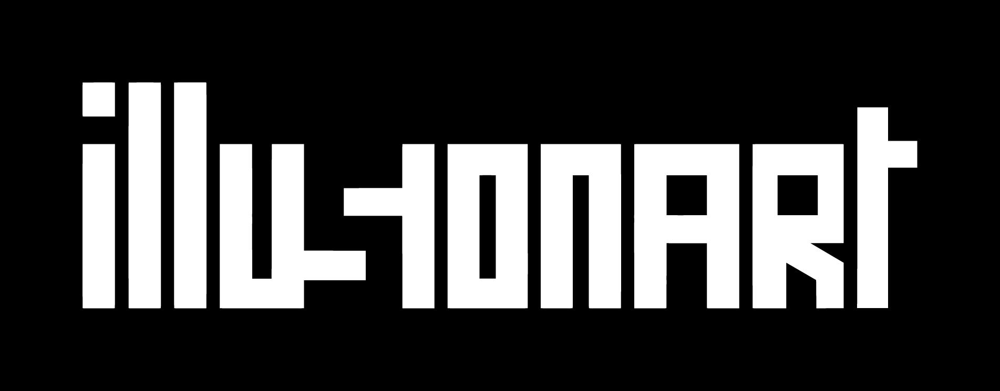

# 🦀 OpenCRAB - Personal AI Assistant (SafeBoot)

<p align="center">
    <picture>
        <source media="(prefers-color-scheme: light)" srcset="./illusionart.png">
        
    </picture>
</p>

<p align="center">
  <strong>YOUR PERSONAL AI ASSISTANT</strong>
</p>

<p align="center">
  <a href="https://github.com/shivamchopra7/OpenCRAB/actions/workflows/ci.yml?branch=main"></a>
  <a href="https://github.com/shivamchopra7/OpenCRAB/releases"></a>
  <a href="https://discord.gg/zTSETY7Mu"></a>
  <a href="LICENSE"></a>
</p>

<p align="center">
  <strong>Product owned by <a href="https://illusionart.ai">illusionart AI Private Limited</a> | Built by <a href="https://shivamchopra.me">Shivam Chopra (Linkedin)</a></strong>
</p>

---

## 👋 Meet OpenCRAB

**OpenCRAB** is a personal AI assistant that lives on **your** computer, not in the cloud. It's smart, safe, and works with the apps you already use.

Imagine an AI that:
*   💬 **Chats with you** on WhatsApp, Telegram, Discord, Slack, and Signal.
*   🧠 **Remembers** your projects, tasks, and preferences.
*   🔒 **Keeps your data private** by running locally on your machine.
*   🛠️ **Can do things** like searching the web, managing files (safely!), and running everyday tasks.

It's like having a smart intern who works 24/7, lives on your laptop, and never gossips.

---

## 🚀 Getting Started (The Easy Way)

You don't need to be a developer to run OpenCRAB. You just need **Docker**.

### Prerequisites
1.  **Install Docker Desktop**:
    *   [Download for Mac, Windows, or Linux](https://www.docker.com/products/docker-desktop/)
    *   Install it and open the app to make sure it's running.

### step-by-step Guide

**1. Get the code**
Open your terminal (Command Prompt on Windows, Terminal on Mac) and run:
```bash
git clone https://github.com/shivamchopra7/OpenCRAB.git
cd OpenCRAB
```

**2. Run the Setup Wizard**
We've made a simple script that sets everything up for you. Just copy and paste this command:
```bash
./docker-setup.sh
```

**3. Follow the Prompts**
The script will ask you a few simple questions (like which AI model to use). Don't worry, the defaults are usually perfect!

**4. Start Chatting!**
Once it finishes, it will give you a link (usually `http://localhost:18789`). Open that in your browser to see your new assistant's dashboard.

From there, you can connect it to WhatsApp, Telegram, or just chat right in the web interface.

---

## 🛡️ Is it Safe?

**Yes.** We designed OpenCRAB with safety and privacy as the #1 priority.

*   ** Sandbox Isolation**: OpenCRAB runs inside a **Docker Container**. Think of this like a secure sandbox or a virtual machine.
*   **No Access to Your Files**: By default, OpenCRAB **cannot see or touch your personal files** (photos, documents, desktop). It lives in its own little bubble.
*   **You Are in Control**: If you *want* it to work on files, you have to explicitly give it permission. Otherwise, it's completely isolated.
*   **Safe Tools**: Every "action" the AI takes (like browsing the web or running a command) happens inside this safe bubble. It can't delete your files or mess up your computer.

You can sleep soundly knowing your AI is powerful but strictly contained. 🦀

---

## ✨ Features

*   **Multi-Channel**: Chat from anywhere – desktop, mobile, or web.
*   **Voice Mode**: Speak to it naturally (requires app setup).
*   **Smart Memory**: It remembers context across conversations.
*   **Web Browsing**: It can look up live info for you.
*   **Live Canvas**: A visual workspace for complex tasks.

---

## 👩‍💻 For Developers (Advanced)

If you want to contribute or build from source, we support a standard Node.js workflow.

**Runtime**: Node ≥22
**Package Manager**: pnpm

```bash
pnpm install
pnpm ui:build
pnpm build
pnpm opencrab onboard --install-daemon
```

For full documentation on architecture, API, and extensions, verify out the [Docs](https://illusionart.ai).

---

## 📚 Documentation & Support

*   **[Official Documentation](https://illusionart.ai)**
*   **[Discord Community](https://discord.gg/zTSETY7Mu)**
*   **[Website](https://illusionart.ai)**

---

## License

MIT License. OpenCRAB is free and open source.
It is built by **[Shivam Chopra](https://shivamchopra.me)** and owned by **[IllusionArt AI](https://illusionart.ai)**.

---

## 🔧 Technical Reference

The following sections cover advanced architecture, configuration, and operational details for power users.


## How it works (short)

```
WhatsApp / Telegram / Slack / Discord / Google Chat / Signal / iMessage / BlueBubbles / Microsoft Teams / Matrix / Zalo / Zalo Personal / WebChat
               │
               ▼
┌───────────────────────────────┐
│            Gateway            │
│       (control plane)         │
│     ws://127.0.0.1:18789      │
└──────────────┬────────────────┘
               │
               ├─ Pi agent (RPC)
               ├─ CLI (opencrab …)
               ├─ WebChat UI
               ├─ macOS app
               └─ iOS / Android nodes
```

## Key subsystems

- **[Gateway WebSocket network](https://docs.openclaw.ai/concepts/architecture)** — single WS control plane for clients, tools, and events (plus ops: [Gateway runbook](https://docs.openclaw.ai/gateway)).
- **[Tailscale exposure](https://docs.openclaw.ai/gateway/tailscale)** — Serve/Funnel for the Gateway dashboard + WS (remote access: [Remote](https://docs.openclaw.ai/gateway/remote)).
- **[Browser control](https://docs.openclaw.ai/tools/browser)** — opencrab‑managed Chrome/Chromium with CDP control.
- **[Canvas + A2UI](https://docs.openclaw.ai/platforms/mac/canvas)** — agent‑driven visual workspace (A2UI host: [Canvas/A2UI](https://docs.openclaw.ai/platforms/mac/canvas#canvas-a2ui)).
- **[Voice Wake](https://docs.openclaw.ai/nodes/voicewake) + [Talk Mode](https://docs.openclaw.ai/nodes/talk)** — always‑on speech and continuous conversation.
- **[Nodes](https://docs.openclaw.ai/nodes)** — Canvas, camera snap/clip, screen record, `location.get`, notifications, plus macOS‑only `system.run`/`system.notify`.

## Tailscale access (Gateway dashboard)

OpenCRAB can auto-configure Tailscale **Serve** (tailnet-only) or **Funnel** (public) while the Gateway stays bound to loopback. Configure `gateway.tailscale.mode`:

- `off`: no Tailscale automation (default).
- `serve`: tailnet-only HTTPS via `tailscale serve` (uses Tailscale identity headers by default).
- `funnel`: public HTTPS via `tailscale funnel` (requires shared password auth).

Notes:

- `gateway.bind` must stay `loopback` when Serve/Funnel is enabled (OpenCRAB enforces this).
- Serve can be forced to require a password by setting `gateway.auth.mode: "password"` or `gateway.auth.allowTailscale: false`.
- Funnel refuses to start unless `gateway.auth.mode: "password"` is set.
- Optional: `gateway.tailscale.resetOnExit` to undo Serve/Funnel on shutdown.

Details: [Tailscale guide](https://docs.openclaw.ai/gateway/tailscale) · [Web surfaces](https://docs.openclaw.ai/web)

## Remote Gateway (Linux is great)

It's perfectly fine to run the Gateway on a small Linux instance. Clients (macOS app, CLI, WebChat) can connect over **Tailscale Serve/Funnel** or **SSH tunnels**, and you can still pair device nodes (macOS/iOS/Android) to execute device‑local actions when needed.

- **Gateway host** runs the exec tool and channel connections by default.
- **Device nodes** run device‑local actions (`system.run`, camera, screen recording, notifications) via `node.invoke`.
  In short: exec runs where the Gateway lives; device actions run where the device lives.

Details: [Remote access](https://docs.openclaw.ai/gateway/remote) · [Nodes](https://docs.openclaw.ai/nodes) · [Security](https://docs.openclaw.ai/gateway/security)

## macOS permissions via the Gateway protocol

The macOS app can run in **node mode** and advertises its capabilities + permission map over the Gateway WebSocket (`node.list` / `node.describe`). Clients can then execute local actions via `node.invoke`:

- `system.run` runs a local command and returns stdout/stderr/exit code; set `needsScreenRecording: true` to require screen-recording permission (otherwise you'll get `PERMISSION_MISSING`).
- `system.notify` posts a user notification and fails if notifications are denied.
- `canvas.*`, `camera.*`, `screen.record`, and `location.get` are also routed via `node.invoke` and follow TCC permission status.

Elevated bash (host permissions) is separate from macOS TCC:

- Use `/elevated on|off` to toggle per‑session elevated access when enabled + allowlisted.
- Gateway persists the per‑session toggle via `sessions.patch` (WS method) alongside `thinkingLevel`, `verboseLevel`, `model`, `sendPolicy`, and `groupActivation`.

Details: [Nodes](https://docs.openclaw.ai/nodes) · [macOS app](https://docs.openclaw.ai/platforms/macos) · [Gateway protocol](https://docs.openclaw.ai/concepts/architecture)

## Agent to Agent (sessions\_\* tools)

- Use these to coordinate work across sessions without jumping between chat surfaces.
- `sessions_list` — discover active sessions (agents) and their metadata.
- `sessions_history` — fetch transcript logs for a session.
- `sessions_send` — message another session; optional reply‑back ping‑pong + announce step (`REPLY_SKIP`, `ANNOUNCE_SKIP`).

Details: [Session tools](https://docs.openclaw.ai/concepts/session-tool)

## Chat commands

Send these in WhatsApp/Telegram/Slack/Google Chat/Microsoft Teams/WebChat (group commands are owner-only):

- `/status` — compact session status (model + tokens, cost when available)
- `/new` or `/reset` — reset the session
- `/compact` — compact session context (summary)
- `/think <level>` — off|minimal|low|medium|high|xhigh (GPT-5.2 + Codex models only)
- `/verbose on|off`
- `/usage off|tokens|full` — per-response usage footer
- `/restart` — restart the gateway (owner-only in groups)
- `/activation mention|always` — group activation toggle (groups only)

## Apps (optional)

The Gateway alone delivers a great experience. All apps are optional and add extra features.

If you plan to build/run companion apps, follow the platform runbooks below.

### macOS (OpenCRAB.app) (optional)

- Menu bar control for the Gateway and health.
- Voice Wake + push-to-talk overlay.
- WebChat + debug tools.
- Remote gateway control over SSH.

Note: signed builds required for macOS permissions to stick across rebuilds (see `docs/mac/permissions.md`).

### iOS node (optional)

- Pairs as a node via the Bridge.
- Voice trigger forwarding + Canvas surface.
- Controlled via `opencrab nodes …`.

Runbook: [iOS connect](https://docs.openclaw.ai/platforms/ios).

### Android node (optional)

- Pairs via the same Bridge + pairing flow as iOS.
- Exposes Canvas, Camera, and Screen capture commands.
- Runbook: [Android connect](https://docs.openclaw.ai/platforms/android).

## Agent workspace + skills

- Workspace root: `~/.opencrab/workspace` (configurable via `agents.defaults.workspace`).
- Injected prompt files: `AGENTS.md`, `SOUL.md`, `TOOLS.md`.
- Skills: `~/.opencrab/workspace/skills/<skill>/SKILL.md`.

## Configuration

Minimal `~/.opencrab/opencrab.json` (model + defaults):

```json5
{
  agent: {
    model: "anthropic/claude-opus-4-5",
  },
}
```

[Full configuration reference (all keys + examples).](https://docs.openclaw.ai/gateway/configuration)

## Security model (important)

- **Default:** tools run on the host for the **main** session, so the agent has full access when it's just you.
- **Group/channel safety:** set `agents.defaults.sandbox.mode: "non-main"` to run **non‑main sessions** (groups/channels) inside per‑session Docker sandboxes; bash then runs in Docker for those sessions.
- **Sandbox defaults:** allowlist `bash`, `process`, `read`, `write`, `edit`, `sessions_list`, `sessions_history`, `sessions_send`, `sessions_spawn`; denylist `browser`, `canvas`, `nodes`, `cron`, `discord`, `gateway`.

Details: [Security guide](https://docs.openclaw.ai/gateway/security) · [Docker + sandboxing](https://docs.openclaw.ai/install/docker) · [Sandbox config](https://docs.openclaw.ai/gateway/configuration)

### [WhatsApp](https://docs.openclaw.ai/channels/whatsapp)

- Link the device: `pnpm opencrab channels login` (stores creds in `~/.opencrab/credentials`).
- Allowlist who can talk to the assistant via `channels.whatsapp.allowFrom`.
- If `channels.whatsapp.groups` is set, it becomes a group allowlist; include `"*"` to allow all.

### [Telegram](https://docs.openclaw.ai/channels/telegram)

- Set `TELEGRAM_BOT_TOKEN` or `channels.telegram.botToken` (env wins).
- Optional: set `channels.telegram.groups` (with `channels.telegram.groups."*".requireMention`); when set, it is a group allowlist (include `"*"` to allow all). Also `channels.telegram.allowFrom` or `channels.telegram.webhookUrl` + `channels.telegram.webhookSecret` as needed.

```json5
{
  channels: {
    telegram: {
      botToken: "123456:ABCDEF",
    },
  },
}
```

### [Slack](https://docs.openclaw.ai/channels/slack)

- Set `SLACK_BOT_TOKEN` + `SLACK_APP_TOKEN` (or `channels.slack.botToken` + `channels.slack.appToken`).

### [Discord](https://docs.openclaw.ai/channels/discord)

- Set `DISCORD_BOT_TOKEN` or `channels.discord.token` (env wins).
- Optional: set `commands.native`, `commands.text`, or `commands.useAccessGroups`, plus `channels.discord.dm.allowFrom`, `channels.discord.guilds`, or `channels.discord.mediaMaxMb` as needed.

```json5
{
  channels: {
    discord: {
      token: "1234abcd",
    },
  },
}
```

### [Signal](https://docs.openclaw.ai/channels/signal)

- Requires `signal-cli` and a `channels.signal` config section.

### [iMessage](https://docs.openclaw.ai/channels/imessage)

- macOS only; Messages must be signed in.
- If `channels.imessage.groups` is set, it becomes a group allowlist; include `"*"` to allow all.

### [Microsoft Teams](https://docs.openclaw.ai/channels/msteams)

- Configure a Teams app + Bot Framework, then add a `msteams` config section.
- Allowlist who can talk via `msteams.allowFrom`; group access via `msteams.groupAllowFrom` or `msteams.groupPolicy: "open"`.

### [WebChat](https://docs.openclaw.ai/web/webchat)

- Uses the Gateway WebSocket; no separate WebChat port/config.

Browser control (optional):

```json5
{
  browser: {
    enabled: true,
    color: "#FF4500",
  },
}
```

## Docs

Use these when you're past the onboarding flow and want the deeper reference.

- [Start with the docs index for navigation and "what's where."](https://docs.openclaw.ai)
- [Read the architecture overview for the gateway + protocol model.](https://docs.openclaw.ai/concepts/architecture)
- [Use the full configuration reference when you need every key and example.](https://docs.openclaw.ai/gateway/configuration)
- [Run the Gateway by the book with the operational runbook.](https://docs.openclaw.ai/gateway)
- [Learn how the Control UI/Web surfaces work and how to expose them safely.](https://docs.openclaw.ai/web)
- [Understand remote access over SSH tunnels or tailnets.](https://docs.openclaw.ai/gateway/remote)
- [Follow the onboarding wizard flow for a guided setup.](https://docs.openclaw.ai/start/wizard)
- [Wire external triggers via the webhook surface.](https://docs.openclaw.ai/automation/webhook)
- [Set up Gmail Pub/Sub triggers.](https://docs.openclaw.ai/automation/gmail-pubsub)
- [Learn the macOS menu bar companion details.](https://docs.openclaw.ai/platforms/mac/menu-bar)
- [Platform guides: Windows (WSL2)](https://docs.openclaw.ai/platforms/windows), [Linux](https://docs.openclaw.ai/platforms/linux), [macOS](https://docs.openclaw.ai/platforms/macos), [iOS](https://docs.openclaw.ai/platforms/ios), [Android](https://docs.openclaw.ai/platforms/android)
- [Debug common failures with the troubleshooting guide.](https://docs.openclaw.ai/channels/troubleshooting)
- [Review security guidance before exposing anything.](https://docs.openclaw.ai/gateway/security)

## Advanced docs (discovery + control)

- [Discovery + transports](https://docs.openclaw.ai/gateway/discovery)
- [Bonjour/mDNS](https://docs.openclaw.ai/gateway/bonjour)
- [Gateway pairing](https://docs.openclaw.ai/gateway/pairing)
- [Remote gateway README](https://docs.openclaw.ai/gateway/remote-gateway-readme)
- [Control UI](https://docs.openclaw.ai/web/control-ui)
- [Dashboard](https://docs.openclaw.ai/web/dashboard)

## Operations & troubleshooting

- [Health checks](https://docs.openclaw.ai/gateway/health)
- [Gateway lock](https://docs.openclaw.ai/gateway/gateway-lock)
- [Background process](https://docs.openclaw.ai/gateway/background-process)
- [Browser troubleshooting (Linux)](https://docs.openclaw.ai/tools/browser-linux-troubleshooting)
- [Logging](https://docs.openclaw.ai/logging)

## Deep dives

- [Agent loop](https://docs.openclaw.ai/concepts/agent-loop)
- [Presence](https://docs.openclaw.ai/concepts/presence)
- [TypeBox schemas](https://docs.openclaw.ai/concepts/typebox)
- [RPC adapters](https://docs.openclaw.ai/reference/rpc)
- [Queue](https://docs.openclaw.ai/concepts/queue)

## Workspace & skills

- [Skills config](https://docs.openclaw.ai/tools/skills-config)
- [Default AGENTS](https://docs.openclaw.ai/reference/AGENTS.default)
- [Templates: AGENTS](https://docs.openclaw.ai/reference/templates/AGENTS)
- [Templates: BOOTSTRAP](https://docs.openclaw.ai/reference/templates/BOOTSTRAP)
- [Templates: IDENTITY](https://docs.openclaw.ai/reference/templates/IDENTITY)
- [Templates: SOUL](https://docs.openclaw.ai/reference/templates/SOUL)
- [Templates: TOOLS](https://docs.openclaw.ai/reference/templates/TOOLS)
- [Templates: USER](https://docs.openclaw.ai/reference/templates/USER)

## Platform internals

- [macOS dev setup](https://docs.openclaw.ai/platforms/mac/dev-setup)
- [macOS menu bar](https://docs.openclaw.ai/platforms/mac/menu-bar)
- [macOS voice wake](https://docs.openclaw.ai/platforms/mac/voicewake)
- [iOS node](https://docs.openclaw.ai/platforms/ios)
- [Android node](https://docs.openclaw.ai/platforms/android)
- [Windows (WSL2)](https://docs.openclaw.ai/platforms/windows)
- [Linux app](https://docs.openclaw.ai/platforms/linux)

## Email hooks (Gmail)

- [docs.openclaw.ai/gmail-pubsub](https://docs.openclaw.ai/automation/gmail-pubsub)

## OpenCRAB

OpenCRAB is a personal AI assistant. 🦀
Product owned by illusionart AI Private Limited.
Built by Shivam Chopra.

- [illusionart.ai](https://illusionart.ai)

## Community

See [CONTRIBUTING.md](CONTRIBUTING.md) for guidelines and how to submit PRs.
AI/vibe-coded PRs welcome! 🤖

## License

MIT License - see [LICENSE](LICENSE) for details.
